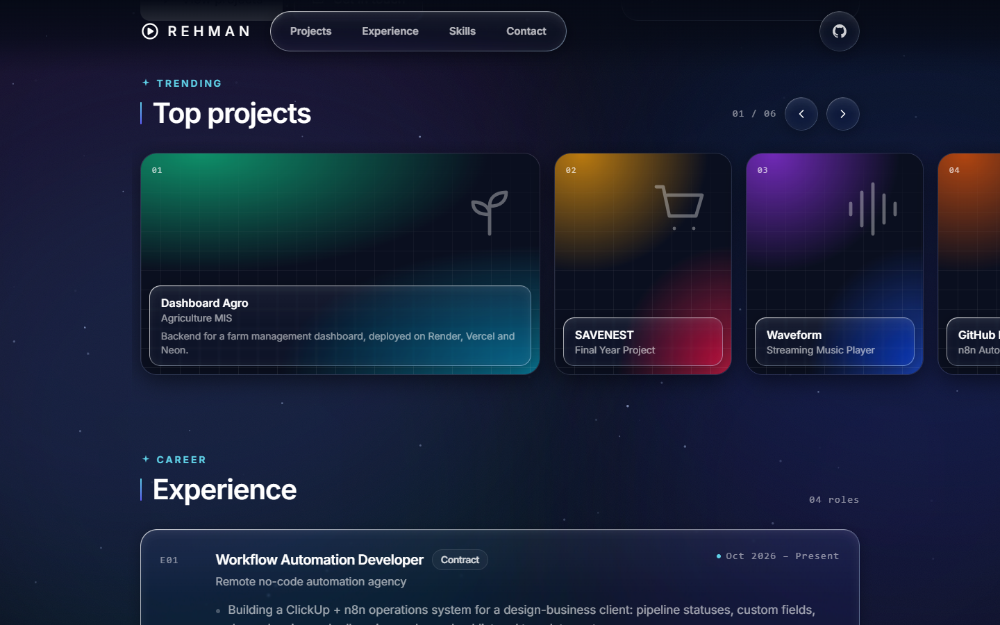

# Liquid Portfolio

Personal portfolio of **Rehman Ashraf** — Software Engineer working on backend development and workflow automation.

It is a single-page site styled like a streaming app: an ambient starfield background with clear "ice" glass panels that refract whatever is behind them. The design system comes from my [Waveform](https://github.com/RehmanAshraf20/Waveform) music player.



## Sections

- **Hero** — intro plus a "Now playing" card for the current role
- **Top projects** — a horizontal shelf of cards; click one for details (the background takes on that project's colors)
- **Experience** — roles listed like episodes
- **Skills** — one glass tile per area
- **Education & certifications**
- **Contact**

## Stack

- React 19 + Vite 8 (JavaScript)
- Tailwind CSS v4 (`@tailwindcss/vite`)
- framer-motion

## Run locally

Requires Node.js 20.19 or newer.

```bash
npm install
npm run dev
```

Other scripts:

```bash
npm run build     # production build to dist/
npm run preview   # serve the production build
npm run lint      # ESLint
```

## Editing content

All text lives in [`src/data/portfolio.js`](src/data/portfolio.js): profile, projects, experience, skills, education and certifications. The components only read from that file.

## Project layout

```
src/
  data/portfolio.js     site content
  lib/motion.js         shared springs, hover/tap and entrance presets
  components/
    AmbientBackground   starfield and drifting color blobs
    GlassPanel          the glass surface used everywhere
    NavBar, Hero, Projects, Experience, Skills, Credentials, Contact
```

## Contact

- Email: rehman786655@gmail.com
- LinkedIn: [linkedin.com/in/rehman-ashraf20](https://www.linkedin.com/in/rehman-ashraf20)
- GitHub: [github.com/RehmanAshraf20](https://github.com/RehmanAshraf20)
